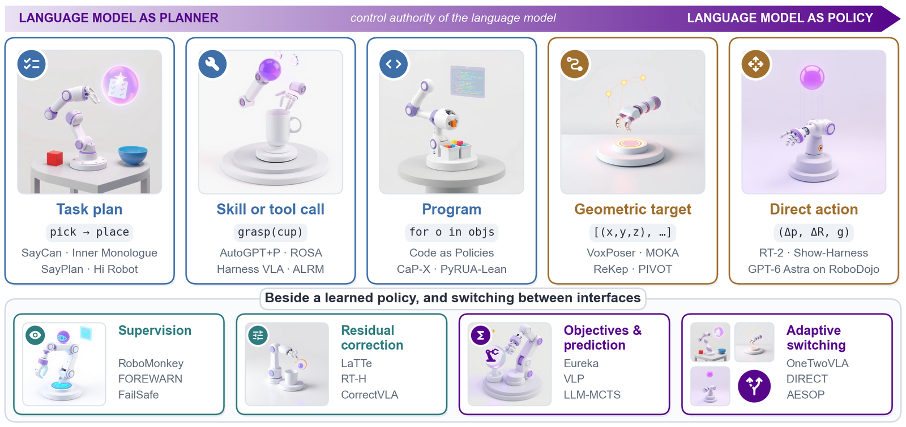

# From Planner to Policy: A Survey of Large Language Models for Robot Control

[](https://tantansir.github.io/llm-for-robot-control/) [](#paper-list) [](#citation)

<p align="center"></p>

This repository accompanies the survey *From Planner to Policy*. The survey reviews how large language models (LLMs), vision-language models (VLMs), and vision-language-action (VLA) models control robots, organized by the action interface: the variable through which the model's output enters the robot control stack, together with the executor that turns it into motor commands. Each interface is described by four descriptors: abstraction level, representation, composition operator, and invocation timing.

- **Project page:** https://tantansir.github.io/llm-for-robot-control/
- **Paper list:** the 221 systems catalogued in Appendix B of the survey, with their interface codes ([below](#paper-list)).
- **Reporting matrix:** of 54 representative systems, 27 report a time quantity for the loop that contains the language model, 23 report model calls or tokens, and 4 report a monetary cost (Table 8 of the survey).

## Paper list

Codes: **Level/role** is the abstraction level of the emitted variable for command interfaces and its role (objective, score, verdict, residual, or prediction) for indirect operators, **Repr.** its representation, **Operator** how it combines with other controllers, and **Timing** when the model is called. Year is the first public version. Entries marked † are reference points whose deciding component is neither a language model nor a VLA (value functions, feature-based monitors, residual learners, video or latent world models). Each row codes the component and configuration that the survey discusses, and Offline timing marks calls during training or before deployment. Missing a paper? Please open an issue or a pull request.

- [Task plans](#task-plans)
- [Tool calls and programs](#tool-calls-and-programs)
- [Motion and action level](#motion-and-action-level)
- [Supervision](#supervision)
- [Corrections](#corrections)
- [Objectives and prediction](#objectives-and-prediction)
- [Memory and multi-agent](#memory-and-multi-agent)
- [Adaptive authority](#adaptive-authority)

### Task plans

*Survey §5.1.*

| System | Year | Paper | Venue | Level/role | Repr. | Operator | Timing |
|---|---|---|---|---|---|---|---|
| **SayCan** | 2022 | [Do As I Can, Not As I Say: Grounding Language in Robotic Affordances](https://arxiv.org/abs/2204.01691) | CoRL 2022 | Skill | Language | Command | Per subtask |
| **Inner Monologue** | 2022 | [Inner Monologue: Embodied Reasoning through Planning with Language Models](https://arxiv.org/abs/2207.05608) | CoRL 2022 | Task | Language | Command | Per subtask |
| **Zero-shot planners** | 2022 | [Language Models as Zero-Shot Planners: Extracting Actionable Knowledge for Embodied Agents](https://arxiv.org/abs/2201.07207) | ICML 2022 | Task | Language | Command | Once |
| **LLM-Planner** | 2022 | [LLM-Planner: Few-Shot Grounded Planning for Embodied Agents with Large Language Models](https://arxiv.org/abs/2212.04088) | ICCV 2023 | Task | Language | Command | Event |
| **Socratic Models** | 2022 | [Socratic Models: Composing Zero-Shot Multimodal Reasoning with Language](https://arxiv.org/abs/2204.00598) | ICLR 2023 | Task | Language | Command | Once |
| **AutoTAMP** | 2023 | [AutoTAMP: Autoregressive Task and Motion Planning with LLMs as Translators and Checkers](https://doi.org/10.1109/ICRA57147.2024.10611163) | ICRA 2024 | Objective | Structured | Specify | Once |
| **PaLM-E** | 2023 | [PaLM-E: An Embodied Multimodal Language Model](https://arxiv.org/abs/2303.03378) | ICML 2023 | Task | Language | Command | Per subtask |
| **ConceptGraphs** | 2023 | [ConceptGraphs: Open-Vocabulary 3D Scene Graphs for Perception and Planning](https://doi.org/10.1109/ICRA57147.2024.10610243) | ICRA 2024 | Motion | Structured | Command | Per query |
| **VILA** | 2023 | [Look Before You Leap: Unveiling the Power of GPT-4V in Robotic Vision-Language Planning](https://arxiv.org/abs/2311.17842) | arXiv 2023 | Task | Language | Command | Per subtask |
| **Grounded Decoding** | 2023 | [Grounded Decoding: Guiding Text Generation with Grounded Models for Embodied Agents](https://arxiv.org/abs/2303.00855) | NeurIPS 2023 | Task | Language | Command | Per subtask |
| **Text2Motion** | 2023 | [Text2Motion: From Natural Language Instructions to Feasible Plans](https://doi.org/10.1007/s10514-023-10131-7) | Auton. Robots 2023 | Skill | Language | Propose | Once |
| **LLM+P** | 2023 | [LLM+P: Empowering Large Language Models with Optimal Planning Proficiency](https://arxiv.org/abs/2304.11477) | arXiv 2023 | Objective | Structured | Specify | Once |
| **EmbodiedGPT** | 2023 | [EmbodiedGPT: Vision-Language Pre-Training via Embodied Chain of Thought](https://arxiv.org/abs/2305.15021) | NeurIPS 2023 | Task | Language | Command | Once |
| **SayPlan** | 2023 | [SayPlan: Grounding Large Language Models using 3D Scene Graphs for Scalable Robot Task Planning](https://arxiv.org/abs/2307.06135) | CoRL 2023 | Task | Structured | Command | Iterative |
| **GPT-4V task planning (Wake et al.)** | 2023 | [GPT-4V(ision) for Robotics: Multimodal Task Planning From Human Demonstration](https://doi.org/10.1109/LRA.2024.3477090) | RA-L 2024 | Skill | Structured | Command | Once |
| **TidyBot** | 2023 | [TidyBot: Personalized Robot Assistance with Large Language Models](https://doi.org/10.1007/s10514-023-10139-z) | Auton. Robots 2023 | Skill | Structured | Command | Once |
| **Goal translation (Xie et al.)** | 2023 | [Translating Natural Language to Planning Goals with Large-Language Models](https://arxiv.org/abs/2302.05128) | arXiv 2023 | Objective | Structured | Specify | Once |
| **Plan-Seq-Learn** | 2024 | [Plan-Seq-Learn: Language Model Guided RL for Solving Long Horizon Robotics Tasks](https://arxiv.org/abs/2405.01534) | ICLR 2024 | Task | Structured | Command | Once |
| **MoMa-LLM** | 2024 | [Language-Grounded Dynamic Scene Graphs for Interactive Object Search with Mobile Manipulation](https://doi.org/10.1109/LRA.2024.3441495) | RA-L 2024 | Skill | Tool call | Command | Per subtask |
| **DELTA** | 2024 | [DELTA: Decomposed Efficient Long-Term Robot Task Planning Using Large Language Models](https://doi.org/10.1109/ICRA55743.2025.11127838) | ICRA 2025 | Objective | Structured | Specify | Once |
| **BUMBLE** | 2024 | [BUMBLE: Unifying Reasoning and Acting with Vision-Language Models for Building-wide Mobile Manipulation](https://doi.org/10.1109/ICRA55743.2025.11128444) | ICRA 2025 | Skill | Tool call | Command | Per subtask |
| **LLM³** | 2024 | [LLM³: Large Language Model-based Task and Motion Planning with Motion Failure Reasoning](https://doi.org/10.1109/IROS58592.2024.10801328) | IROS 2024 | Skill | Structured | Propose | Iterative |
| **RoboBrain 2.0** | 2025 | [RoboBrain 2.0 Technical Report](https://arxiv.org/abs/2507.02029) | arXiv 2025 | Task | Language | Command | Per subtask |
| **Robix** | 2025 | [Robix: A Unified Model for Robot Interaction, Reasoning and Planning](https://arxiv.org/abs/2509.01106) | arXiv 2025 | Task | Language | Command | Per subtask |
| **RoboBrain** | 2025 | [RoboBrain: A Unified Brain Model for Robotic Manipulation from Abstract to Concrete](https://arxiv.org/abs/2502.21257) | CVPR 2025 | Task | Language | Command | Per query |
| **Cosmos-Reason1** | 2025 | [Cosmos-Reason1: From Physical Common Sense To Embodied Reasoning](https://arxiv.org/abs/2503.15558) | arXiv 2025 | Task | Language | Command | Per query |
| **Embodied-Reasoner** | 2025 | [Embodied-Reasoner: Synergizing Visual Search, Reasoning, and Action for Embodied Interactive Tasks](https://doi.org/10.18653/v1/2026.acl-long.1910) | ACL 2026 | Skill | Language | Command | Per subtask |
| **Hierarchical VLA agent study** | 2026 | [What Matters in Orchestrating Robot Policies: A Systematic Study of Hierarchical VLA Agents](https://arxiv.org/abs/2606.10267) | arXiv 2026 | Task | Language | Command | Event |
| **SparkVLA** | 2026 | [SparkVLA: Stop-Aware Hierarchical VLA with Adaptive Action Chunking for Long-Horizon Manipulation](https://arxiv.org/abs/2608.16172) | arXiv 2026 | Task | Language | Command | Event |
| **LoHo-Manip** | 2026 | [Long-Horizon Manipulation via Trace-Conditioned VLA Planning](https://arxiv.org/abs/2604.21924) | arXiv 2026 | Task | Language | Command | Per subtask |

### Tool calls and programs

*Survey §5.2 and §5.3.*

| System | Year | Paper | Venue | Level/role | Repr. | Operator | Timing |
|---|---|---|---|---|---|---|---|
| **Code as Policies** | 2022 | [Code as Policies: Language Model Programs for Embodied Control](https://doi.org/10.1109/ICRA48891.2023.10160591) | ICRA 2023 | Program | Code | Command | Once |
| **ProgPrompt** | 2022 | [ProgPrompt: Generating Situated Robot Task Plans using Large Language Models](https://doi.org/10.1109/ICRA48891.2023.10161317) | ICRA 2023 | Program | Code | Command | Fixed points |
| **Phase-step BT generation** | 2023 | [Robot Behavior-Tree-Based Task Generation with Large Language Models](https://ceur-ws.org/Vol-3433/paper4.pdf) | AAAI Spring Symposium 2023 | Program | Structured | Propose | Once |
| **CodeBotler** | 2023 | [Deploying and Evaluating LLMs to Program Service Mobile Robots](https://doi.org/10.1109/LRA.2024.3360020) | RA-L 2024 | Program | Code | Command | Once |
| **Instruct2Act** | 2023 | [Instruct2Act: Mapping Multi-modality Instructions to Robotic Actions with Large Language Model](https://arxiv.org/abs/2305.11176) | arXiv 2023 | Program | Code | Command | Once |
| **VoxPoser** | 2023 | [VoxPoser: Composable 3D Value Maps for Robotic Manipulation with Language Models](https://proceedings.mlr.press/v229/huang23b.html) | CoRL 2023 | Objective | Code | Specify | Per subtask |
| **Trajectory generators** | 2023 | [Language Models as Zero-Shot Trajectory Generators](https://doi.org/10.1109/LRA.2024.3410155) | RA-L 2024 | Motion | Code | Command | Once |
| **LLM-BRAIn** | 2023 | [LLM-BRAIn: AI-driven Fast Generation of Robot Behaviour Tree based on Large Language Model](https://doi.org/10.1109/FLLM63129.2024.10852491) | FLLM 2024 | Program | Structured | Propose | Once |
| **ChatGPT for Robotics** | 2023 | [ChatGPT for Robotics: Design Principles and Model Abilities](https://doi.org/10.1109/ACCESS.2024.3387941) | IEEE Access 2024 | Program | Code | Command | Once |
| **Demo2Code** | 2023 | [Demo2Code: From Summarizing Demonstrations to Synthesizing Code via Extended Chain-of-Thought](https://arxiv.org/abs/2305.16744) | NeurIPS 2023 | Program | Code | Command | Once |
| **RoboTool** | 2023 | [Creative Robot Tool Use with Large Language Models](https://arxiv.org/abs/2310.13065) | arXiv 2023 | Program | Code | Command | Once |
| **Statler** | 2023 | [Statler: State-Maintaining Language Models for Embodied Reasoning](https://doi.org/10.1109/ICRA57147.2024.10610634) | ICRA 2024 | Program | Code | Command | Per query |
| **LLM-as-BT-Planner** | 2024 | [LLM-as-BT-Planner: Leveraging LLMs for Behavior Tree Generation in Robot Task Planning](https://doi.org/10.1109/ICRA55743.2025.11128454) | ICRA 2025 | Program | Structured | Propose | Once |
| **AutoGPT+P** | 2024 | [AutoGPT+P: Affordance-based Task Planning using Large Language Models](https://doi.org/10.15607/RSS.2024.XX.112) | RSS 2024 | Skill | Structured | Command | Per step |
| **LLM-OBTEA** | 2024 | [Integrating Intent Understanding and Optimal Behavior Planning for Behavior Tree Generation from Human Instructions](https://doi.org/10.24963/ijcai.2024/755) | IJCAI 2024 | Objective | Structured | Specify | Once |
| **RoboScript** | 2024 | [RoboScript: Code Generation for Free-Form Manipulation Tasks across Real and Simulation](https://arxiv.org/abs/2402.14623) | arXiv 2024 | Program | Code | Command | Once |
| **BTGenBot** | 2024 | [BTGenBot: Behavior Tree Generation for Robotic Tasks with Lightweight LLMs](https://doi.org/10.1109/IROS58592.2024.10802304) | IROS 2024 | Program | Structured | Propose | Once |
| **LMPC** | 2024 | [Learning to Learn Faster from Human Feedback with Language Model Predictive Control](https://doi.org/10.15607/RSS.2024.XX.125) | RSS 2024 | Objective | Code | Specify | Event |
| **ROS-LLM** | 2024 | [A Robot Operating System Framework for Using Large Language Models in Embodied AI](https://doi.org/10.1038/s42256-026-01186-z) | Nat. Mach. Intell. 2026 | Program | Code | Command | Once |
| **RoboCodeX** | 2024 | [RoboCodeX: Multimodal Code Generation for Robotic Behavior Synthesis](https://proceedings.mlr.press/v235/mu24a.html) | ICML 2024 | Program | Code | Command | Once |
| **ROSA** | 2024 | [Enabling Novel Mission Operations and Interactions with ROSA: The Robot Operating System Agent](https://doi.org/10.1109/AERO63441.2025.11068426) | IEEE Aerospace 2025 | Skill | Tool call | Command | Per step |
| **BETR-XP-LLM** | 2024 | [Automatic Behavior Tree Expansion with LLMs for Robotic Manipulation](https://doi.org/10.1109/ICRA55743.2025.11127942) | ICRA 2025 | Objective | Structured | Specify | Event |
| **CodeAct (non-robot)** | 2024 | [Executable Code Actions Elicit Better LLM Agents](https://proceedings.mlr.press/v235/wang24h.html) | ICML 2024 | Program | Code | Command | Per step |
| **Code-as-Monitor** | 2024 | [Code-as-Monitor: Constraint-aware Visual Programming for Reactive and Proactive Robotic Failure Detection](https://arxiv.org/abs/2412.04455) | CVPR 2025 | Program | Code | Monitor | Per subtask |
| **RAI** | 2025 | [RAI: Flexible Agent Framework for Embodied AI](https://doi.org/10.1007/978-3-032-05925-3_16) | PAAMS Highlights 2025 | Skill | Tool call | Command | Per step |
| **RHO** | 2026 | [RHO: Your Coding Agent is Secretly a Roboticist](https://arxiv.org/abs/2606.16458) | arXiv 2026 | Program | Code | Command | Offline |
| **CaP-X** | 2026 | [CaP-X: A Framework for Benchmarking and Improving Coding Agents for Robot Manipulation](https://arxiv.org/abs/2603.22435) | ICML 2026 | Program | Code | Command | Per step |
| **ALRM (TaP)** | 2026 | [ALRM: Agentic LLM for Robotic Manipulation](https://arxiv.org/abs/2601.19510) | arXiv 2026 | Skill | Tool call | Command | Per step |
| **BTGenBot-2** | 2026 | [BTGenBot-2: Efficient Behavior Tree Generation with Small Language Models](https://arxiv.org/abs/2602.01870) | arXiv 2026 | Program | Structured | Command | Event |
| **Agent as Policy** | 2026 | [Agent as Policy for Robotic Manipulation](https://arxiv.org/abs/2609.12541) | arXiv 2026 | Motion | Tool call | Command | Per step |
| **AgentRob** | 2026 | [AgentRob: From Virtual Forum Agents to Hijacked Physical Robots](https://arxiv.org/abs/2602.13591) | arXiv 2026 | Skill | Tool call | Command | Per step |
| **ASPIRE** | 2026 | [ASPIRE: Agentic /Skills Discovery for Robotics](https://arxiv.org/abs/2607.00272) | arXiv 2026 | Program | Code | Command | Iterative |
| **VLCP** | 2026 | [VLCP: Vision Language Control Policy Closed-Loop Code Replanning for Robot Manipulation](https://arxiv.org/abs/2608.16978) | arXiv 2026 | Action | Code | Command | Periodic |
| **Contract-grounded BT synthesis** | 2026 | [Contract-Grounded Behavior Tree Synthesis via Coding Agents](https://arxiv.org/abs/2607.12220) | arXiv 2026 | Program | Structured | Command | Once |
| **EmbodiedSWE** | 2026 | [EmbodiedSWE: Coding Agents for Long Horizon Dexterous Robotics](https://arxiv.org/abs/2609.27308) | arXiv 2026 | Program | Code | Command | Iterative |
| **PyRUA-Lean** | 2026 | [Fewer Tokens, Better Action: GPT-6 Astra Robot Agents with 14% Higher Success Rate but 65% Fewer Tokens](https://arxiv.org/abs/2610.01939) | arXiv 2026 | Program | Code | Command | Per step |
| **FAEA** | 2026 | [Demonstration-Free Robotic Control via LLM Agents](https://arxiv.org/abs/2601.20334) | IROS 2026 | Program | Code | Command | Iterative |
| **Harness VLA** | 2026 | [Harness VLA: Steering Frozen VLAs into Reliable Manipulation Primitives via Memory-Guided Agents](https://arxiv.org/abs/2607.08448) | arXiv 2026 | Skill | Tool call | Command | Per step |
| **Embodied Tool Protocol** | 2026 | [Enabling Extensible Embodied Capabilities with Tools](https://arxiv.org/abs/2605.26637) | arXiv 2026 | Skill | Tool call | Command | Per step |

### Motion and action level

*Survey §6.*

| System | Year | Paper | Venue | Level/role | Repr. | Operator | Timing |
|---|---|---|---|---|---|---|---|
| **RT-Trajectory** | 2023 | [RT-Trajectory: Robotic Task Generalization via Hindsight Trajectory Sketches](https://arxiv.org/abs/2311.01977) | ICLR 2024 | Motion | Code | Command | Once |
| **Pattern machines** | 2023 | [Large Language Models as General Pattern Machines](https://arxiv.org/abs/2307.04721) | CoRL 2023 | Action | Numeric text | Command | Periodic |
| **SayTap** | 2023 | [SayTap: Language to Quadrupedal Locomotion](https://arxiv.org/abs/2306.07580) | CoRL 2023 | Motion | Structured | Command | Event |
| **Prompted walking** | 2023 | [Prompt a Robot to Walk with Large Language Models](https://doi.org/10.1109/CDC56724.2024.10885862) | CDC 2024 | Action | Numeric text | Command | Periodic |
| **KAT** | 2024 | [Keypoint Action Tokens Enable In-Context Imitation Learning in Robotics](https://doi.org/10.15607/RSS.2024.XX.096) | RSS 2024 | Motion | Numeric text | Command | Once |
| **MOKA** | 2024 | [MOKA: Open-World Robotic Manipulation through Mark-Based Visual Prompting](https://doi.org/10.15607/RSS.2024.XX.062) | RSS 2024 | Motion | Structured | Command | Per subtask |
| **CoPa** | 2024 | [CoPa: General Robotic Manipulation through Spatial Constraints of Parts with Foundation Models](https://doi.org/10.1109/IROS58592.2024.10801352) | IROS 2024 | Motion | Language | Specify | Once |
| **ReKep** | 2024 | [ReKep: Spatio-Temporal Reasoning of Relational Keypoint Constraints for Robotic Manipulation](https://arxiv.org/abs/2409.01652) | CoRL 2024 | Objective | Code | Specify | Once |
| **LLaRA** | 2024 | [LLaRA: Supercharging Robot Learning Data for Vision-Language Policy](https://arxiv.org/abs/2406.20095) | ICLR 2025 | Motion | Numeric text | Command | Per step |
| **PIVOT** | 2024 | [PIVOT: Iterative Visual Prompting Elicits Actionable Knowledge for VLMs](https://arxiv.org/abs/2402.07872) | ICML 2024 | Motion | Structured | Command | Per step |
| **MALMM** | 2024 | [MALMM: Multi-Agent Large Language Models for Zero-Shot Robotic Manipulation](https://doi.org/10.1109/IROS60139.2025.11247340) | IROS 2025 | Motion | Code | Command | Per step |
| **Wonderful Team** | 2024 | [Wonderful Team: Zero-Shot Physical Task Planning with Visual LLMs](https://arxiv.org/abs/2407.19094) | arXiv 2024 | Motion | Structured | Command | Per subtask |
| **RoboPrompt** | 2024 | [In-Context Learning Enables Robot Action Prediction in LLMs](https://doi.org/10.1109/ICRA55743.2025.11128807) | ICRA 2025 | Motion | Numeric text | Command | Once |
| **RoboPoint** | 2024 | [RoboPoint: A Vision-Language Model for Spatial Affordance Prediction in Robotics](https://arxiv.org/abs/2406.10721) | CoRL 2024 | Motion | Numeric text | Command | Once |
| **ECoT** | 2024 | [Robotic Control via Embodied Chain-of-Thought Reasoning](https://arxiv.org/abs/2407.08693) | CoRL 2024 | Action | Action tokens | Command | Periodic |
| **VLA-0** | 2025 | [VLA-0: Building State-of-the-Art VLAs with Zero Modification](https://arxiv.org/abs/2510.13054) | arXiv 2025 | Action | Numeric text | Command | Periodic |
| **MolmoAct** | 2025 | [MolmoAct: Action Reasoning Models that can Reason in Space](https://arxiv.org/abs/2508.07917) | ICRA 2026 | Action | Action tokens | Command | Periodic |
| **VeBrain** | 2025 | [Visual Embodied Brain: Let Multimodal Large Language Models See, Think, and Control in Spaces](https://arxiv.org/abs/2506.00123) | arXiv 2025 | Motion | Numeric text | Command | Periodic |
| **OmniManip** | 2025 | [OmniManip: Towards General Robotic Manipulation via Object-Centric Interaction Primitives as Spatial Constraints](https://doi.org/10.1109/CVPR52734.2025.01618) | CVPR 2025 | Motion | Structured | Specify | Per subtask |
| **SoFar** | 2025 | [SoFar: Language-Grounded Orientation Bridges Spatial Reasoning and Object Manipulation](https://arxiv.org/abs/2502.13143) | NeurIPS 2025 | Motion | Structured | Command | Once |
| **GeoManip** | 2025 | [GeoManip: Geometric Constraints as General Interfaces for Robot Manipulation](https://arxiv.org/abs/2501.09783) | arXiv 2025 | Objective | Code | Specify | Per subtask |
| **Embodied-R1** | 2025 | [Embodied-R1: Reinforced Embodied Reasoning for General Robotic Manipulation](https://arxiv.org/abs/2508.13998) | ICLR 2026 | Motion | Numeric text | Command | Per subtask |
| **RoboRefer** | 2025 | [RoboRefer: Towards Spatial Referring with Reasoning in Vision-Language Models for Robotics](https://arxiv.org/abs/2506.04308) | NeurIPS 2025 | Motion | Numeric text | Command | Per subtask |
| **Embody evaluation** | 2026 | [Claude Plays Robotics](https://www.anthropic.com/research/claude-plays-robotics) | Blog 2026 | Action | Tool call | Command | Per step |
| **Show-Harness** | 2026 | [Show-Harness: Just a VLM Agent Can Play Robots](https://arxiv.org/abs/2609.10522) | arXiv 2026 | Action | Structured | Command | Per step |
| **MolmoAct2** | 2026 | [MolmoAct2: Action Reasoning Models for Real-world Deployment](https://arxiv.org/abs/2605.02881) | arXiv 2026 | Action | Action head | Command | Periodic |
| **GPT-6 Astra on RoboDojo** | 2026 | [An Unexpected Robot Policy: Early Evaluations of GPT-6 Astra on RoboDojo and Beyond](https://arxiv.org/abs/2609.24170) | arXiv 2026 | Motion | Tool call | Command | Per step |

### Supervision

*Survey §7.1.*

| System | Year | Paper | Venue | Level/role | Repr. | Operator | Timing |
|---|---|---|---|---|---|---|---|
| **SuccessVQA** | 2023 | [Vision-Language Models as Success Detectors](https://arxiv.org/abs/2303.07280) | CoLLAs 2023 | Score | Language | Verify | After run |
| **DoReMi** | 2023 | [DoReMi: Grounding Language Model by Detecting and Recovering from Plan-Execution Misalignment](https://doi.org/10.1109/IROS58592.2024.10802284) | IROS 2024 | Score | Language | Monitor | Periodic |
| **REFLECT** | 2023 | [REFLECT: Summarizing Robot Experiences for Failure Explanation and Correction](https://arxiv.org/abs/2306.15724) | CoRL 2023 | Score | Language | Verify | After run |
| **Sentinel** | 2024 | [Unpacking Failure Modes of Generative Policies: Runtime Monitoring of Consistency and Progress](https://arxiv.org/abs/2410.04640) | CoRL 2024 | Score | Language | Monitor | Fixed points |
| **Recover** | 2024 | [Recover: A Neuro-Symbolic Framework for Failure Detection and Recovery](https://doi.org/10.1109/IROS58592.2024.10801853) | IROS 2024 | Task | Language | Correct | Event |
| **RACER** | 2024 | [RACER: Rich Language-Guided Failure Recovery Policies for Imitation Learning](https://doi.org/10.1109/ICRA55743.2025.11127799) | ICRA 2025 | Residual | Language | Correct | Periodic |
| **AHA** | 2024 | [AHA: A Vision-Language-Model for Detecting and Reasoning Over Failures in Robotic Manipulation](https://arxiv.org/abs/2410.00371) | ICLR 2025 | Score | Language | Verify | Per subtask |
| **GVL** | 2024 | [Vision Language Models are In-Context Value Learners](https://arxiv.org/abs/2411.04549) | ICLR 2025 | Score | Language | Verify | Once |
| **V-GPS †** | 2024 | [Steering Your Generalists: Improving Robotic Foundation Models via Value Guidance](https://arxiv.org/abs/2410.13816) | CoRL 2024 | Verdict | Scalar | Verify | Periodic |
| **COME-robot** | 2024 | [Closed-Loop Open-Vocabulary Mobile Manipulation with GPT-4V](https://doi.org/10.1109/ICRA55743.2025.11127975) | ICRA 2025 | Verdict | Code | Verify | Event |
| **SOAR** | 2024 | [Autonomous Improvement of Instruction Following Skills via Foundation Models](https://arxiv.org/abs/2407.20635) | CoRL 2024 | Score | Language | Monitor | Once |
| **SAFE †** | 2025 | [SAFE: Multitask Failure Detection for Vision-Language-Action Models](https://arxiv.org/abs/2506.09937) | NeurIPS 2025 | Score | Scalar | Monitor | Periodic |
| **RoboMonkey** | 2025 | [RoboMonkey: Scaling Test-Time Sampling and Verification for Vision-Language-Action Models](https://arxiv.org/abs/2506.17811) | CoRL 2025 | Verdict | Scalar | Verify | Periodic |
| **FailSafe** | 2025 | [FailSafe: Reasoning and Recovery from Failures in Vision-Language-Action Models](https://arxiv.org/abs/2510.01642) | IROS 2026 | Residual | Numeric text | Correct | Periodic |
| **Phoenix** | 2025 | [Phoenix: A Motion-based Self-Reflection Framework for Fine-grained Robotic Action Correction](https://arxiv.org/abs/2504.14588) | CVPR 2025 | Verdict | Language | Verify | Periodic |
| **RoboFAC** | 2025 | [RoboFAC: A Comprehensive Framework for Robotic Failure Analysis and Correction](https://arxiv.org/abs/2505.12224) | arXiv 2025 | Residual | Language | Correct | Fixed points |
| **Astra-gated π0.5** | 2026 | [Astra-Gated VLA Hybrid Rollout in RoboDojo](https://github.com/Alanq0327/astra-VLA-robodojo-hybrid-rollout) | GitHub 2026 | Verdict | Language | Verify | Per decision |
| **GPT-6 Astra hybrid control (Galbot)** | 2026 | [Systematically Exploring the Capabilities of GPT-6 Astra as Embodied Policies](https://arxiv.org/abs/2609.38537) | arXiv 2026 | Motion | Tool call | Correct | Per decision |
| **CorrectVLA** | 2026 | [Training-Free Action Correction for VLA Model Failures via Language Feedback](https://arxiv.org/abs/2608.29967) | arXiv 2026 | Residual | Structured | Correct | Once |
| **FLARE** | 2026 | [FLARE: A Failure-Aware Framework for Autonomous Correction and Recovery in Visual-Language Robotic Manipulation](https://arxiv.org/abs/2608.26645) | CVPR 2026 | Verdict | Language | Monitor | Event |

### Corrections

*Survey §7.2.*

| System | Year | Paper | Venue | Level/role | Repr. | Operator | Timing |
|---|---|---|---|---|---|---|---|
| **Trajectory reshaping †** | 2022 | [Reshaping Robot Trajectories Using Natural Language Commands: A Study of Multi-Modal Data Alignment Using Transformers](https://doi.org/10.1109/IROS47612.2022.9981810) | IROS 2022 | Residual | Language | Correct | Event |
| **LaTTe †** | 2022 | [LATTE: LAnguage Trajectory TransformEr](https://doi.org/10.1109/ICRA48891.2023.10161068) | ICRA 2023 | Residual | Action head | Correct | Event |
| **Interactive Language** | 2022 | [Interactive Language: Talking to Robots in Real Time](https://doi.org/10.1109/LRA.2023.3295255) | RA-L 2023 | Action | Language | Correct | Periodic |
| **Plan corrections (Sharma et al.) †** | 2022 | [Correcting Robot Plans with Natural Language Feedback](https://doi.org/10.15607/RSS.2022.XVIII.065) | RSS 2022 | Objective | Language | Correct | Event |
| **LILAC** | 2023 | [``No, to the Right'': Online Language Corrections for Robotic Manipulation via Shared Autonomy](https://doi.org/10.1145/3568162.3578623) | HRI 2023 | Residual | Language | Correct | Event |
| **DROC** | 2023 | [Distilling and Retrieving Generalizable Knowledge for Robot Manipulation via Language Corrections](https://doi.org/10.1109/ICRA57147.2024.10610455) | ICRA 2024 | Program | Code | Correct | Event |
| **ResiP †** | 2024 | [From Imitation to Refinement – Residual RL for Precise Assembly](https://doi.org/10.1109/ICRA55743.2025.11127442) | ICRA 2025 | Residual | -- | Correct | Periodic |
| **RT-H** | 2024 | [RT-H: Action Hierarchies Using Language](https://doi.org/10.15607/RSS.2024.XX.049) | RSS 2024 | Skill | Language | Command | Periodic |
| **TRANSIC †** | 2024 | [TRANSIC: Sim-to-Real Policy Transfer by Learning from Online Correction](https://arxiv.org/abs/2405.10315) | CoRL 2024 | Residual | -- | Correct | Periodic |
| **YAY Robot** | 2024 | [Yell At Your Robot: Improving On-the-Fly from Language Corrections](https://doi.org/10.15607/RSS.2024.XX.025) | RSS 2024 | Residual | Language | Correct | Event |
| **ExTraCT †** | 2024 | [ExTraCT – Explainable Trajectory Corrections for Language-Based Human-Robot Interaction Using Textual Feature Descriptions](https://doi.org/10.3389/frobt.2024.1345693) | Front. Robot. AI 2024 | Residual | Language | Correct | Event |
| **Policy Decorator †** | 2024 | [Policy Decorator: Model-Agnostic Online Refinement for Large Policy Model](https://arxiv.org/abs/2412.13630) | ICLR 2025 | Residual | -- | Correct | Periodic |
| **Hi Robot** | 2025 | [Hi Robot: Open-Ended Instruction Following with Hierarchical Vision-Language-Action Models](https://arxiv.org/abs/2502.19417) | ICML 2025 | Task | Language | Command | Periodic |
| **PLD †** | 2025 | [Self-Improving Vision-Language-Action Models with Data Generation via Residual RL](https://arxiv.org/abs/2511.00091) | ICLR 2026 | Residual | Action head | Correct | Periodic |
| **ReCoVLA** | 2026 | [ReCoVLA: VLM-Guided Reward Compilation for Failure Recovery in Vision-Language-Action Policies](https://arxiv.org/abs/2606.09630) | arXiv 2026 | Objective | Structured | Specify | Offline |

### Objectives and prediction

*Survey §7.3 and §7.4.*

| System | Year | Paper | Venue | Level/role | Repr. | Operator | Timing |
|---|---|---|---|---|---|---|---|
| **SuSIE †** | 2023 | [Zero-Shot Robotic Manipulation with Pre-Trained Image-Editing Diffusion Models](https://arxiv.org/abs/2310.10639) | ICLR 2024 | Prediction | Images | Predict | Periodic |
| **UniPi †** | 2023 | [Learning Universal Policies via Text-Guided Video Generation](https://arxiv.org/abs/2302.00111) | NeurIPS 2023 | Prediction | Images | Predict | Once |
| **Video Language Planning** | 2023 | [Video Language Planning](https://arxiv.org/abs/2310.10625) | ICLR 2024 | Task | Language | Propose | Per decision |
| **NL2LTL** | 2023 | [NL2LTL – a Python Package for Converting Natural Language (NL) Instructions to Linear Temporal Logic (LTL) Formulas](https://doi.org/10.1609/aaai.v37i13.27068) | AAAI 2023 | Objective | Structured | Specify | Once |
| **RAP** | 2023 | [Reasoning with Language Model is Planning with World Model](https://doi.org/10.18653/v1/2023.emnlp-main.507) | EMNLP 2023 | Prediction | Language | Predict | Iterative |
| **Reward design with LMs** | 2023 | [Reward Design with Language Models](https://arxiv.org/abs/2303.00001) | ICLR 2023 | Objective | Language | Specify | Per episode |
| **Lang2LTL** | 2023 | [Grounding Complex Natural Language Commands for Temporal Tasks in Unseen Environments](https://arxiv.org/abs/2302.11649) | CoRL 2023 | Objective | Structured | Specify | Once |
| **Eureka** | 2023 | [Eureka: Human-Level Reward Design via Coding Large Language Models](https://arxiv.org/abs/2310.12931) | ICLR 2024 | Objective | Code | Specify | Offline |
| **VLM-RMs †** | 2023 | [Vision-Language Models are Zero-Shot Reward Models for Reinforcement Learning](https://arxiv.org/abs/2310.12921) | ICLR 2024 | Objective | Scalar | Specify | Periodic |
| **LanguageMPC** | 2023 | [LanguageMPC: Large Language Models as Decision Makers for Autonomous Driving](https://arxiv.org/abs/2310.03026) | arXiv 2023 | Objective | Language | Specify | Periodic |
| **Self-refined reward design** | 2023 | [Self-Refined Large Language Model as Automated Reward Function Designer for Deep Reinforcement Learning in Robotics](https://arxiv.org/abs/2309.06687) | arXiv 2023 | Objective | Code | Specify | Offline |
| **RoboGen** | 2023 | [RoboGen: Towards Unleashing Infinite Data for Automated Robot Learning via Generative Simulation](https://arxiv.org/abs/2311.01455) | ICML 2024 | Objective | Code | Specify | Offline |
| **Text2Reward** | 2023 | [Text2Reward: Reward Shaping with Language Models for Reinforcement Learning](https://arxiv.org/abs/2309.11489) | ICLR 2024 | Objective | Code | Specify | Offline |
| **UniSim †** | 2023 | [Learning Interactive Real-World Simulators](https://arxiv.org/abs/2310.06114) | ICLR 2024 | Prediction | Images | Predict | Offline |
| **Language to Rewards** | 2023 | [Language to Rewards for Robotic Skill Synthesis](https://arxiv.org/abs/2306.08647) | CoRL 2023 | Objective | Code | Specify | Once |
| **LLM-MCTS** | 2023 | [Large Language Models as Commonsense Knowledge for Large-Scale Task Planning](https://arxiv.org/abs/2305.14078) | NeurIPS 2023 | Prediction | Language | Predict | Per step |
| **DrEureka** | 2024 | [DrEureka: Language Model Guided Sim-To-Real Transfer](https://doi.org/10.15607/RSS.2024.XX.094) | RSS 2024 | Objective | Code | Specify | Offline |
| **RL-VLM-F** | 2024 | [RL-VLM-F: Reinforcement Learning from Vision Language Foundation Model Feedback](https://arxiv.org/abs/2402.03681) | ICML 2024 | Objective | Language | Verify | Periodic |
| **VLMPC** | 2024 | [VLMPC: Vision-Language Model Predictive Control for Robotic Manipulation](https://doi.org/10.15607/RSS.2024.XX.106) | RSS 2024 | Score | Language | Propose | Periodic |
| **V-JEPA 2-AC †** | 2025 | [V-JEPA 2: Self-Supervised Video Models Enable Understanding, Prediction and Planning](https://arxiv.org/abs/2506.09985) | arXiv 2025 | Prediction | Latent | Predict | Periodic |
| **WorldVLA** | 2025 | [WorldVLA: Towards Autoregressive Action World Model](https://arxiv.org/abs/2506.21539) | arXiv 2025 | Action | Action tokens | Command | Periodic |
| **Ctrl-World †** | 2025 | [Ctrl-World: A Controllable Generative World Model for Robot Manipulation](https://arxiv.org/abs/2510.10125) | ICLR 2026 | Prediction | Images | Predict | Offline |
| **DreamGen †** | 2025 | [DreamGen: Unlocking Generalization in Robot Learning through Video World Models](https://arxiv.org/abs/2505.12705) | CoRL 2025 | Prediction | Images | Predict | Offline |
| **Genie Envisioner †** | 2025 | [Genie Envisioner: A Unified World Foundation Platform for Robotic Manipulation](https://arxiv.org/abs/2508.05635) | ICLR 2026 | Prediction | Images | Predict | Periodic |
| **Robo-Dopamine** | 2025 | [General Process Reward Modeling for Robotic Reinforcement Learning](https://arxiv.org/abs/2512.23703) | CVPR 2026 | Score | Numeric text | Specify | Periodic |
| **VLAC** | 2025 | [A Vision-Language-Action-Critic Model for Robotic Real-World Reinforcement Learning](https://arxiv.org/abs/2509.15937) | arXiv 2025 | Score | Numeric text | Specify | Periodic |
| **τ0-VLA** | 2026 | [τ0-VLA: a Hierarchical Robot Foundation Model with World-Model-Guided Test-Time Computation](https://arxiv.org/abs/2608.16885) | arXiv 2026 | Task | Language | Propose | Event |
| **RoboReward** | 2026 | [RoboReward: General-Purpose Vision-Language Reward Models for Robotics](https://arxiv.org/abs/2601.00675) | arXiv 2026 | Score | Numeric text | Specify | Per episode |
| **Robometer** | 2026 | [Robometer: Scaling General-Purpose Robotic Reward Models via Trajectory Comparisons](https://doi.org/10.15607/RSS.2026.XXII.140) | RSS 2026 | Score | Scalar | Specify | Periodic |
| **World Action Agent** | 2026 | [World Action Agent: Harnessing VLMs for Robot Manipulation via World Action Rehearsal](https://arxiv.org/abs/2609.29964) | arXiv 2026 | Motion | Tool call | Propose | Per step |
| **World Action Planner** | 2026 | [World Action Planner: Generalizable Decision-Making with Action-Conditioned World Models](https://arxiv.org/abs/2607.27599) | arXiv 2026 | Motion | Structured | Propose | Fixed points |

### Memory and multi-agent

*Survey §8.*

| System | Year | Paper | Venue | Level/role | Repr. | Operator | Timing |
|---|---|---|---|---|---|---|---|
| **Central vs. decentralized (Chen et al.)** | 2023 | [Scalable Multi-Robot Collaboration with Large Language Models: Centralized or Decentralized Systems?](https://doi.org/10.1109/ICRA57147.2024.10610676) | ICRA 2024 | Skill | Language | Command | Per step |
| **SMART-LLM** | 2023 | [SMART-LLM: Smart Multi-Agent Robot Task Planning using Large Language Models](https://doi.org/10.1109/IROS58592.2024.10802322) | IROS 2024 | Program | Code | Command | Once |
| **RoCo** | 2023 | [RoCo: Dialectic Multi-Robot Collaboration with Large Language Models](https://doi.org/10.1109/ICRA57147.2024.10610855) | ICRA 2024 | Task | Language | Command | Per step |
| **Voyager (game)** | 2023 | [Voyager: An Open-Ended Embodied Agent with Large Language Models](https://arxiv.org/abs/2305.16291) | TMLR 2024 | Program | Code | Command | Iterative |
| **Safety Chip** | 2023 | [Plug in the Safety Chip: Enforcing Constraints for LLM-driven Robot Agents](https://doi.org/10.1109/ICRA57147.2024.10611447) | ICRA 2024 | Objective | Structured | Specify | Once |
| **BOSS** | 2023 | [Bootstrap Your Own Skills: Learning to Solve New Tasks with Large Language Model Guidance](https://arxiv.org/abs/2310.10021) | CoRL 2023 | Skill | Language | Propose | Offline |
| **CoELA** | 2023 | [Building Cooperative Embodied Agents Modularly with Large Language Models](https://arxiv.org/abs/2307.02485) | ICLR 2024 | Task | Language | Command | Per step |
| **ReMEmbR** | 2024 | [ReMEmbR: Building and Reasoning Over Long-Horizon Spatio-Temporal Memory for Robot Navigation](https://doi.org/10.1109/ICRA55743.2025.11127706) | ICRA 2025 | Task | Tool call | Command | Per query |
| **EMOS** | 2024 | [EMOS: Embodiment-aware Heterogeneous Multi-robot Operating System with LLM Agents](https://arxiv.org/abs/2410.22662) | ICLR 2025 | Task | Language | Command | Once |
| **COHERENT** | 2024 | [COHERENT: Collaboration of Heterogeneous Multi-Robot System with Large Language Models](https://doi.org/10.1109/ICRA55743.2025.11127808) | ICRA 2025 | Task | Language | Command | Per step |
| **LLaMAR** | 2024 | [Long-Horizon Planning for Multi-Agent Robots in Partially Observable Environments](https://arxiv.org/abs/2407.10031) | NeurIPS 2024 | Task | Language | Command | Per step |
| **DART-LLM** | 2024 | [DART-LLM: Dependency-Aware Multi-Robot Task Decomposition and Execution using Large Language Models](https://arxiv.org/abs/2411.09022) | arXiv 2024 | Task | Structured | Command | Once |
| **KARMA** | 2024 | [KARMA: Augmenting Embodied AI Agents with Long-and-Short Term Memory Systems](https://doi.org/10.1109/ICRA55743.2025.11128047) | ICRA 2025 | Task | Language | Command | Per query |
| **Embodied-RAG** | 2024 | [Embodied-RAG: General Non-parametric Embodied Memory for Retrieval and Generation](https://arxiv.org/abs/2409.18313) | arXiv 2024 | Task | Language | Command | Per query |
| **Mobility VLA** | 2024 | [Mobility VLA: Multimodal Instruction Navigation with Long-Context VLMs and Topological Graphs](https://arxiv.org/abs/2407.07775) | CoRL 2024 | Motion | Structured | Command | Once |
| **Reachability filter (Hafez et al.)** | 2025 | [Safe LLM-Controlled Robots with Formal Guarantees via Reachability Analysis](https://arxiv.org/abs/2503.03911) | arXiv 2025 | Action | Numeric text | Command | Periodic |
| **ELLMER** | 2025 | [Embodied Large Language Models Enable Robots to Complete Complex Tasks in Unpredictable Environments](https://doi.org/10.1038/s42256-025-01005-x) | Nat. Mach. Intell. 2025 | Program | Code | Command | Once |
| **RoboGuard** | 2025 | [Safety Guardrails for LLM-Enabled Robots](https://doi.org/10.1109/LRA.2026.3667488) | RA-L 2026 | Objective | Structured | Specify | Per decision |
| **MemoryVLA** | 2025 | [MemoryVLA: Perceptual-Cognitive Memory in Vision-Language-Action Models for Robotic Manipulation](https://arxiv.org/abs/2508.19236) | ICLR 2026 | Action | Action head | Command | Periodic |
| **MemER** | 2025 | [Scaling up Memory for Robotic Control via Experience Retrieval](https://arxiv.org/abs/2510.20328) | ICLR 2026 | Task | Language | Command | Periodic |
| **SAMALM** | 2025 | [Multi-Agent LLM Actor-Critic Framework for Social Robot Navigation](https://arxiv.org/abs/2503.09758) | arXiv 2025 | Action | Numeric text | Command | Per step |
| **REMAC** | 2025 | [REMAC: Self-Reflective and Self-Evolving Multi-Agent Collaboration for Long-Horizon Robot Manipulation](https://doi.org/10.1016/j.patcog.2026.114831) | Pattern Recognition 2027 | Task | Language | Command | Per subtask |
| **SafeVLA** | 2025 | [SafeVLA: Towards Safety Alignment of Vision-Language-Action Model via Constrained Learning](https://doi.org/10.52202/085713-5128) | NeurIPS 2025 | Action | Action tokens | Command | Per step |
| **Three-tier Astra on RoboMME** | 2026 | [Can Astra Solve RoboMME without Breaking the Bank? A Three-Tier System for Memory-Augmented Manipulation](https://bingaochen.github.io/Astra-on-RoboMME/) | GitHub 2026 | Task | Language | Command | Event |
| **Reachability gate (Dwedar et al.)** | 2026 | [Safe Multi-Robot Coordination via VLM-LLM Reasoning and Reachability Analysis](https://arxiv.org/abs/2609.27816) | arXiv 2026 | Task | Structured | Propose | Periodic |
| **Closed-loop multi-agent (He et al.)** | 2026 | [A Closed-Loop Multi-Agent Framework for Robust Multi-Robot Manipulation](https://doi.org/10.15607/RSS.2026.XXII.036) | RSS 2026 | Task | Structured | Command | Per subtask |
| **MEM** | 2026 | [MEM: Multi-Scale Embodied Memory for Vision Language Action Models](https://arxiv.org/abs/2603.03596) | arXiv 2026 | Task | Language | Command | Per subtask |

### Adaptive authority

*Survey §9.*

| System | Year | Paper | Venue | Level/role | Repr. | Operator | Timing |
|---|---|---|---|---|---|---|---|
| **When2Ask** | 2023 | [Enabling Intelligent Interactions between an Agent and an LLM: A Reinforcement Learning Approach](https://arxiv.org/abs/2306.03604) | RLJ 2024 | Task | Language | Command | Event |
| **KnowNo** | 2023 | [Robots That Ask For Help: Uncertainty Alignment for Large Language Model Planners](https://arxiv.org/abs/2307.01928) | CoRL 2023 | Task | Language | Propose | Per step |
| **RoboDual** | 2024 | [Towards Synergistic, Generalized, and Efficient Dual-System for Robotic Manipulation](https://arxiv.org/abs/2410.08001) | arXiv 2024 | Action | Action tokens | Command | Periodic |
| **Introspective planning** | 2024 | [Introspective Planning: Aligning Robots' Uncertainty with Inherent Task Ambiguity](https://arxiv.org/abs/2402.06529) | NeurIPS 2024 | Task | Language | Propose | Per step |
| **LCB** | 2024 | [From LLMs to Actions: Latent Codes as Bridges in Hierarchical Robot Control](https://doi.org/10.1109/IROS58592.2024.10801683) | IROS 2024 | Latent | Latent | Command | Periodic |
| **AESOP** | 2024 | [Real-Time Anomaly Detection and Reactive Planning with Large Language Models](https://doi.org/10.15607/RSS.2024.XX.114) | RSS 2024 | Verdict | Language | Monitor | Event |
| **DeeR-VLA** | 2024 | [DeeR-VLA: Dynamic Inference of Multimodal Large Language Models for Efficient Robot Execution](https://arxiv.org/abs/2411.02359) | NeurIPS 2024 | Action | Action head | Command | Periodic |
| **HiRT** | 2024 | [HiRT: Enhancing Robotic Control with Hierarchical Robot Transformers](https://arxiv.org/abs/2410.05273) | CoRL 2024 | Latent | Latent | Command | Periodic |
| **π0.5** | 2025 | [π0.5: a Vision-Language-Action Model with Open-World Generalization](https://arxiv.org/abs/2504.16054) | CoRL 2025 | Task | Language | Command | Two rates |
| **Real-time chunking** | 2025 | [Real-Time Execution of Action Chunking Flow Policies](https://arxiv.org/abs/2506.07339) | NeurIPS 2025 | Action | Action head | Command | Periodic |
| **Fast-in-Slow** | 2025 | [Fast-in-Slow: A Dual-System VLA Model Unifying Fast Manipulation within Slow Reasoning](https://arxiv.org/abs/2506.01953) | NeurIPS 2025 | Action | Action head | Command | Periodic |
| **Helix** | 2025 | [Helix: A Vision-Language-Action Model for Generalist Humanoid Control](https://www.figure.ai/news/helix) | Blog 2025 | Action | Action head | Command | Periodic |
| **Gemini Robotics** | 2025 | [Gemini Robotics: Bringing AI into the Physical World](https://arxiv.org/abs/2503.20020) | arXiv 2025 | Program | Code | Command | Per step |
| **Gemini Robotics 1.5 (orchestrator)** | 2025 | [Gemini Robotics 1.5: Pushing the Frontier of Generalist Robots with Advanced Embodied Reasoning, Thinking, and Motion Transfer](https://arxiv.org/abs/2510.03342) | arXiv 2025 | Task | Language | Command | Per subtask |
| **ThinkAct** | 2025 | [ThinkAct: Vision-Language-Action Reasoning via Reinforced Visual Latent Planning](https://arxiv.org/abs/2507.16815) | NeurIPS 2025 | Latent | Latent | Command | Periodic |
| **G0** | 2025 | [Galaxea Open-World Dataset and G0 Dual-System VLA Model](https://arxiv.org/abs/2509.00576) | arXiv 2025 | Task | Language | Command | Two rates |
| **HAMSTER** | 2025 | [HAMSTER: Hierarchical Action Models for Open-World Robot Manipulation](https://arxiv.org/abs/2502.05485) | ICLR 2025 | Motion | Structured | Command | Once |
| **SwitchVLA** | 2025 | [SwitchVLA: Execution-Aware Task Switching for Vision-Language-Action Models](https://arxiv.org/abs/2506.03574) | arXiv 2025 | Action | Action head | Command | Periodic |
| **SP-VLA** | 2025 | [SP-VLA: A Joint Model Scheduling and Token Pruning Approach for VLA Model Acceleration](https://arxiv.org/abs/2506.12723) | ICLR 2026 | Action | Action tokens | Command | Event |
| **OneTwoVLA** | 2025 | [OneTwoVLA: A Unified Vision-Language-Action Model with Adaptive Reasoning](https://arxiv.org/abs/2505.11917) | ICLR 2026 | Task | Language | Command | Event |
| **GR00T N1** | 2025 | [GR00T N1: An Open Foundation Model for Generalist Humanoid Robots](https://arxiv.org/abs/2503.14734) | arXiv 2025 | Action | Action head | Command | Periodic |
| **SmolVLA (asynchronous)** | 2025 | [SmolVLA: A Vision-Language-Action Model for Affordable and Efficient Robotics](https://arxiv.org/abs/2506.01844) | arXiv 2025 | Action | Action head | Command | Event |
| **Hume** | 2025 | [Hume: Introducing System-2 Thinking in Visual-Language-Action Model](https://arxiv.org/abs/2505.21432) | arXiv 2025 | Verdict | Scalar | Verify | Periodic |
| **FlashVLA** | 2025 | [Think Twice, Act Once: Token-Aware Compression and Action Reuse for Efficient Inference in Vision-Language-Action Models](https://arxiv.org/abs/2505.21200) | arXiv 2025 | Action | Action tokens | Command | Event |
| **FOREWARN** | 2025 | [From Foresight to Forethought: VLM-In-the-Loop Policy Steering via Latent Alignment](https://doi.org/10.15607/RSS.2025.XXI.076) | RSS 2025 | Verdict | Language | Verify | Per decision |
| **Agentic Robot (verifier)** | 2025 | [Agentic Robot: A Brain-Inspired Framework for Vision-Language-Action Models in Embodied Agents](https://arxiv.org/abs/2505.23450) | arXiv 2025 | Verdict | Language | Verify | Periodic |
| **LoHoVLA** | 2025 | [LoHoVLA: A Unified Vision-Language-Action Model for Long-Horizon Embodied Tasks](https://arxiv.org/abs/2506.00411) | arXiv 2025 | Task | Language | Command | Event |
| **DIRECT** | 2026 | [DIRECT: When and Where Should You Allocate Test-Time Compute in Embodied Planners?](https://arxiv.org/abs/2606.12402) | arXiv 2026 | Task | Language | Command | Per subtask |
| **DVAC** | 2026 | [Denoising Tells When to Replan: Denoising-Variance Adaptive Chunking for Flow-Based Robot Policies](https://arxiv.org/abs/2606.03847) | arXiv 2026 | Action | Action head | Command | Event |
| **AAC** | 2026 | [Adaptive Action Chunking at Inference-time for Vision-Language-Action Models](https://arxiv.org/abs/2604.04161) | CVPR 2026 | Action | Action head | Command | Event |
| **BCP** | 2026 | [Continue or Replan? Bernoulli-Continuation Policy Learning for Adaptive Horizon Execution](https://arxiv.org/abs/2608.03483) | arXiv 2026 | Action | Action head | Command | Event |
| **UPS** | 2026 | [When to Act, Ask, or Learn: Uncertainty-Aware Policy Steering](https://doi.org/10.15607/RSS.2026.XXII.142) | RSS 2026 | Verdict | Language | Verify | Fixed points |

## Citation

```bibtex
@misc{tan2026plannerpolicy,
  title  = {From Planner to Policy: A Survey of Large Language Models for Robot Control},
  author = {Tan, Kaizhen},
  year   = {2026},
  note   = {Project page: https://tantansir.github.io/llm-for-robot-control/}
}
```

## Asset notes

Icons in the figures are glyph outlines from [Google Material Symbols](https://github.com/google/material-design-icons) (Apache License 2.0). The illustrations in the teaser figure were generated with FLUX.1-schnell (Apache License 2.0) and are schematic.
